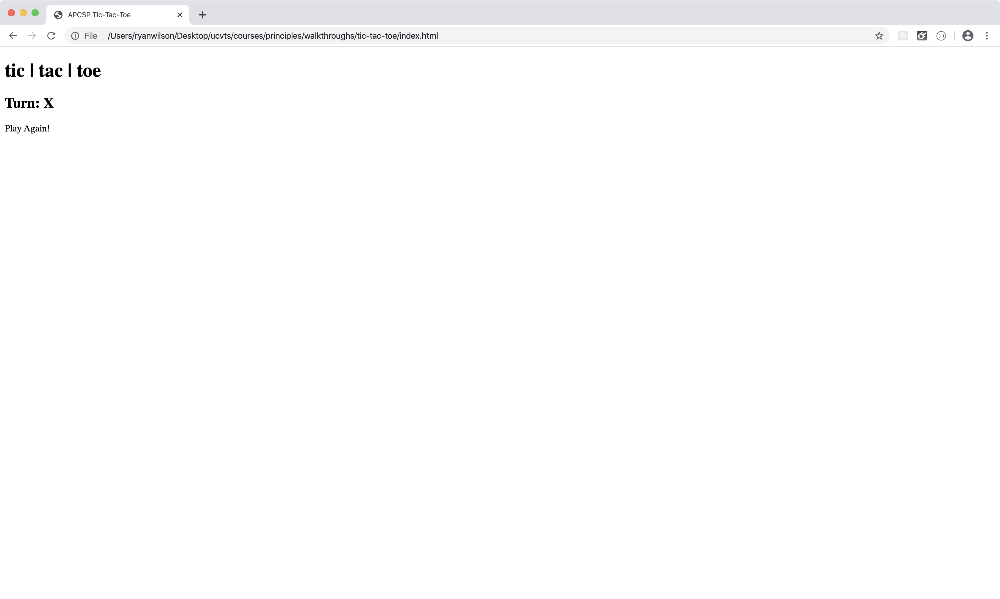
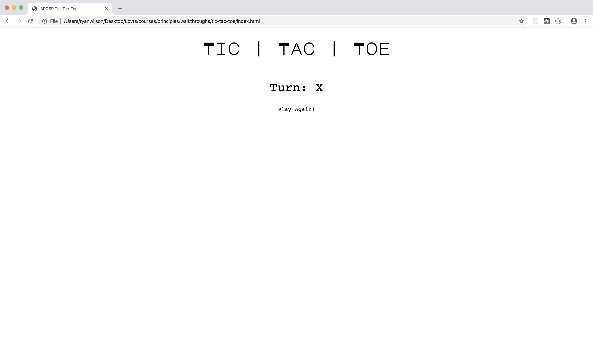
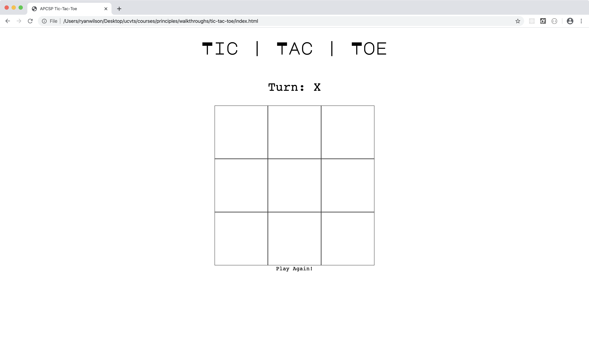
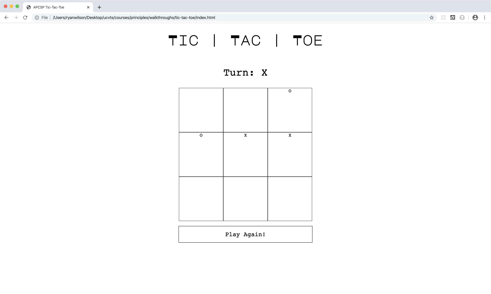
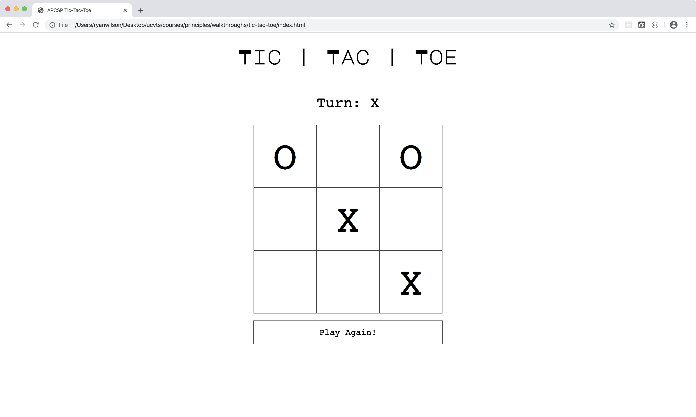

# Tic-Tac-Toe Walkthrough

When working on a large-scale project or application, it's critical that you divide the workload into more manageable chunks. While this isn't a very large project, we can use it as a stepping stone to learn where and how to start a project when all we have are requirements.

Follow along carefully. Although you're copying what I'm doing, it's important that you take the time to understand the decisions I'm making. Stop, ask questions, experiment with the code. This is what good programmers do, and it's the only way you'll truly grasp the material.

## Requirements

This is a pretty simple game, and one we've all played at some point in our lives. The requirements aren't too extensive, but they are precise.

- Display a 3-by-3 grid of squares.
- Indicate the current state of the game.
  - Has a player won, and if so, who?
  - Has the game ended in a tie?
  - Whose turn is it?
- Allow each player to mark the board with an X or an O in alternating fashion.
  - Prevent players from overwriting each others' marks.
- Provide a means by which to reset the game and play again.

## Basic Structure

Before we dive into the requirements, let's create our project structure. Every project needs a root directory, so create a folder (and call it whatever you'd like).

Inside of your parent folder, create two additional folders.

- `css`
- `js`

And three files.

- `index.html`
- `js/app.js`
- `css/styles.css`

Now, your project structure should look like this.

```
tic-tac-toe/
  css/
    styles.css
  js/
    app.js
  index.html
```

Next, open up the `index.html` file. A basic template has a `head` and `body` section, which will initially be empty.

```html
<!DOCTYPE html>

<html lang="en">
  <head>
    <meta charset="UTF-8" />
    <meta name="viewport" content="width=device-width, initial-scale=1.0" />
    <meta http-equiv="X-UA-Compatible" content="ie=edge" />

    <title>Tic | Tac | Toe</title>
  </head>
  <body>
    <!-- we'll fill this in later -->
  </body>
</html>
```

Lastly, hook up your CSS and JavaScript to your HTML template.

```html
<!DOCTYPE html>

<html lang="en">
  <head>
    <meta charset="UTF-8" />
    <meta name="viewport" content="width=device-width, initial-scale=1.0" />
    <meta http-equiv="X-UA-Compatible" content="ie=edge" />

    <link
      href="https://fonts.googleapis.com/css?family=Major+Mono+Display"
      rel="stylesheet"
    />
    <link href="css/styles.css" rel="stylesheet" type="text/css" />
    <script defer src="js/app.js"></script>

    <title>Tic | Tac | Toe</title>
  </head>
  <body>
    <!-- we'll fill this in later -->
  </body>
</html>
```

If you're paying attention, you probably noticed that we have two CSS files. One is ours, which we created in the `css` folder. The other is from Google APIs. It lets us use a particular font.

## User Stories

A user story is an informal description of a feature or use case of a software system. These are commonly used in the planning and design stages of the software development lifecycle. We're writing a tic-tac-toe app, so let's talk about what behaviors we'll need to support.

### Gameboard

This is the foundation of the entire game, and it's usually represented by a 3-by-3 grid. Let's start with the presentation layer, which is how we'll display the board in the browser.

Put this in the `body` of your HTML.

```html
<h1>tic | tac | toe</h1>

<div class="container column">
  <h2>Turn: X</h2>

  <div class="container wrap" id="board">
    <div class="square"></div>
    <div class="square"></div>
    <div class="square"></div>
    <div class="square"></div>
    <div class="square"></div>
    <div class="square"></div>
    <div class="square"></div>
    <div class="square"></div>
    <div class="square"></div>
  </div>

  <div id="reset-button">Play Again!</div>
</div>
```

Without a little CSS, our board isn't going to look very much like a board. Go ahead and open up your `index.html` file in the browser and you'll see what I mean.



Pretty ugly, I know. So let's style it - and feel free to modify these styles however you'd like!

```css
/*
 * Sets the overall styles for the page. There aren't many. All text is
 * centered, and the font is a monospaced Roboto (from Google).
 */

body {
  text-align: center;
  font-family: "Roboto", monospace;
}

/*
 * The header has a different font than the rest of the page. It's the title, so
 * it makes sense to make it a little different (and bigger).
 */

h1 {
  margin: 0 auto;
  font-family: "Major Mono Display", monospace;
  font-size: 48px;
  margin: 2%;
}

/*
 * The subheader (which let's us know whose turn it is) is a little smaller and
 * less prominent.
 */

h2 {
  font-size: 36px;
  font-weight: lighter;
  margin: 2%;
}

/*
 * The container is a flex-box, which is a powerful layout tool. It grows
 * dyanamically, and allows us to position our elements with precision.
 *
 * This encloses everything from the turn indicator to the reset button.
 */

.container {
  display: flex; /* set our display property to use flex-box */
  justify-content: center; /* center container horizontally */
  align-items: center; /* center content vertically */
}

/*
 * We want to display the subheader, board, and reset button in a single
 * vertical column.
 */

.column {
  height: 100%;
  width: 100%;
  flex-direction: column; /* align children in columns instead of rows */
}
```

We're not done yet, but we've made some progress. Refresh the page and you'll see that our fonts have been applied, and everything is positioned in a vertical column centered on the page.



Where's the board, though? Since the `div`s representing the board and its interior squares are empty, there's nothing to display. We can add borders to render the grid on the page.

```css
/*
 * This ensures that we get three rows of three squares, rather than a single
 * row of nine squares.
 *
 * The height and width are based on the size of the squares, which includes
 * their borders.
 */

.wrap {
  flex-wrap: wrap; /* tells squares to drop down if width is exceeded */
  height: 456px;
  width: 456px;
}

/*
 * The square itself. We give it a specific size and border.
 */

.square {
  border: 1px solid rgba(0, 0, 0, 0.75);
  height: 150px;
  user-select: none;
  width: 150px;
}

/*
 * And we give it a little flare when the user mouses over a square.
 */

.square:hover {
  background-color: lightgray;
  cursor: pointer;
}
```

Refresh again and things should be much closer to what we want. The board is now visible, and the squares highlight when we hover over them.



The only thing left to style is the reset button.

```css
/*
 * The reset button sits just below the board.
 */

#reset-button {
  background-color: white;
  border: 1px solid black;
  color: black;
  font-size: 21px;
  line-height: 55px;
  margin: 1%;
  text-align: center;
  width: 456px;
}

/*
 * And a little flare when the user mouses over the button. The color scheme
 * switches (background and foreground).
 */

#reset-button:hover {
  background-color: black;
  color: white;
  cursor: pointer;
}
```


Flexbox is a powerful layout tool, but there's a bit of a learning curve associated with it. Don't be shy - [dive into the documentation](https://css-tricks.com/snippets/css/a-guide-to-flexbox/) and try it out yourself!

### Xs and Os

Now that we have our board, it's time to put some Xs and Os on it. Without this piece of functionality, we can't really play tic-tac-toe, can we? Let's think about what this logic needs to look like in our code. Naturally, it'll live in our JavaScript file.

Open up `app.js` and create these organizational headers.

```javascript
///////////////////// CONSTANTS /////////////////////////////////////

///////////////////// APP STATE (VARIABLES) /////////////////////////

///////////////////// CACHED ELEMENT REFERENCES /////////////////////

///////////////////// EVENT LISTENERS ///////////////////////////////

///////////////////// FUNCTIONS /////////////////////////////////////
```

Now, declare a variable to represent the board in the app state section.

```javascript
let board;
```

We also need a function to initialize the state of our game (i.e., construct the board). We'll use an array, initially pre-loaded with empty strings to represent the grid squares. This goes in the functions section.

```javascript
function init() {
  board = ["", "", "", "", "", "", "", "", ""];

  render(); // we'll write this later
}
```

We need to make sure our `init` function is called. There are a few different ways to go about doing this. We're going to attach it to an `onload` listener and throw it in our event listeners section.

```javascript
window.onload = init;
```

This function will be called as soon as the page finishes loading.

Now, back to that `render` function. Whenever a player takes a turn, we'll need to render either an X or an O on the board. Sounds like something we'll need to do an awful lot, so let's setup a function stub to handle it. We'll fill in the details later. This, too, goes in the functions section.

```javascript
function render() {
  // todo
}
```

So what does our `render` function need to do? It needs to be able to iterate over each row on the board and each square in that row. Remember those built-in Array methods? Time to put them to good use. For now, we'll just print stuff to the console.

```javascript
function render() {
  board.forEach(function(mark, index) {
    console.log(mark, index);
  });
}
```

In order to interact with our board, we need the current state of the board as it exists in the browser. We'll use some built-in magic to grab that from the HTML. Put this in the cached element references section.

```javascript
const squares = Array.from(document.querySelectorAll("#board div"));
```

`Array.from` builds an array from all of the elements returned by `querySelectorAll`. We're using `querySelectorAll` to find the element whose ID is `board`, then grabbing all of the children `div`s of that element. Saves us the time and hassle of providing each square a unique ID, selecting them individually, and building the array manually.

Now, we're going to use our `squares` array in the `render` function.

```javascript
function render() {
  board.forEach(function(mark, index) {
    squares[index].textContent = mark; // writes an X or an O on board
  });
}
```

### Taking Turns

Taking turns is an integral part of many games, and tic-tac-toe is no different. After X takes a turn, the game must understand that it is now O's turn. This back-and-forth pattern continues until someone wins or until a tie occurs.

To keep track of whose turn it is, let's declare another variable. This goes in the app state section, right underneath our `board` variable.

```javascript
let turn;
```

We're going to initialize the `turn` variable in the `init` function.

```javascript
function init() {
  board = ["", "", "", "", "", "", "", "", ""];

  turn = "X";

  render();
}
```

A _turn_ manifests itself in the form of a user action; in this case, a player clicking the board to mark a square with either an X or an O. We need to provide some code to listen for and respond to that action. Add a reference to a soon-to-be-written function in the event listeners section.

```javascript
document.getElementById("board").onclick = takeTurn;
```

Let's go ahead and write our `takeTurn` function. It takes a single argument, `e`, which represents the click event.

```javascript
function takeTurn(e) {
  let index = squares.findIndex(function(square) {
    return square === e.target;
  });
}
```

The first part of the `takeTurn` function finds the index of the square that was clicked. It does so by matching the event target to one of the squares in our initial `squares` array. Now that we have our index, we can modify the board.

```javascript
function takeTurn(e) {
  let index = squares.findIndex(function(square) {
    return square === e.target;
  });

  board[index] = turn;
  turn = turn === "X" ? "O" : "X"; // alternate turns

  render();
}
```

If we test our code, it looks like it's working. Click a few squares and you'll see it renders Xs and Os in alternating fashion. The font is pretty tiny, though.



Modify the existing `.square` class in your `styles.css` file to make the Xs and Os bigger.

```css
.square {
  border: 1px solid rgba(0, 0, 0, 0.75);
  font-size: 96px;
  height: 150px;
  line-height: 150px;
  user-select: none;
  width: 150px;
}
```

There we go - an increase to the `font-size` and `line-height` did the trick.



Everything looks good, but the subheader (that indicates whose turn it is) isn't updating. Let's fix that. Whenever we render the board, we'll update the subheader with the correct player. First, create another variable in the cached references section.

```javascript
const message = document.querySelector("h2"); // grab the subheader
```

Then, update `render` to dynamically give our subheader a value.

```javascript
function render() {
  board.forEach(function(mark, index) {
    squares[index].textContent = mark; // writes an X or an O on board
  });

  message.textContent = `Turn: ${turn}`;
}
```

Perfect. We can take turns and everything looks good. The only problem is the game keeps going even after someone wins. We haven't yet implemented the logic to determine if a player has won or if the players have tied. Let's do that now.

Add another variable to the app state section.

```javascript
let win;
```

Just like with `turn`, we need to add a line to the `init` function to initialize `win`.

```javascript
function init() {
  board = ["", "", "", "", "", "", "", "", ""];

  turn = "X";
  win = null;

  render();
}
```

A player has won if they've placed their mark (either an X or an O) in three consecutive squares: horizontally, vertically, or diagonally. Let's start to think about what this might look like in our code.

We can use a series of `if` statements to check each winning condition. Starting with the top row, that would look something like this.

```javascript
if (board[0] && board[0] === board[1] && board[1] === board[2]) {
  win = board[0];   // either X or O
} else if (/* next winning condition */) {
  win = board[0];   // either X or O
}

// and so on, and so forth...
```

As an aside, we're first checking that there's something in `board[0]`. If all three squares have nothing in them, they'll produce a false positive in terms of our equality test. That's why we need `board[0]` in the beginning of our `if` condition.

Moving on... While this works, it seems like a lot of repetitive code. How about ternary statements?

```javascript
win =
  board[0] && board[0] === board[1] && board[1] === board[2] ? board[0] : null; // X, O, or null

// and so on, and so forth
```

This works, too, and we're doing a lot of the same things. We can do better, though. Let's write out all of the possible winning conditions (there's only 8) and put them in the constants section.

```javascript
const winningConditions = [
  [0, 1, 2],
  [3, 4, 5],
  [6, 7, 8],
  [0, 3, 6],
  [1, 4, 7],
  [2, 5, 8],
  [0, 4, 8],
  [2, 4, 6]
];
```

We're going to need to check for a winner after each turn. Sounds like a good reason to write a function. As you might've guessed, put this in the functions section.

```javascript
function getWinner() {
  let winner = null;

  winningConditions.forEach(function(condition, index) {
    if (
      board[condition[0]] &&
      board[condition[0]] === board[condition[1]] &&
      board[condition[1]] === board[condition[2]]
    ) {
      winner = board[condition[0]];
    }
  });

  return winner;
}
```

This is very similar to our original logic, except it's streamlined because we're using our 2D array of preset winning conditions. Before we can test it out, we need to actually call our `getWinner` function. Whenever a player takes a turn, we'll call it to see if that turn resulted in a win.

```javascript
function takeTurn(e) {
  let index = squares.findIndex(function(square) {
    return square === e.target;
  });

  board[index] = turn;
  turn = turn === "X" ? "O" : "X";
  win = getWinner();

  render();
}
```

See the call to `getWinner`? We're also going to modify `render` so that our subheader can report a winner if there is one.

```javascript
function render() {
  board.forEach(function(mark, index) {
    squares[index].textContent = mark;
  });

  message.textContent = win ? `${win} wins!` : `Turn: ${turn}`;
}
```

Go ahead and test out your app! Looks pretty good, right? We're not quite done yet, though. When a player wins, we want to halt the game. A quick modification to the `takeTurn` function will fix that.

```javascript
function takeTurn(e) {
  if (!win) {
    let index = squares.findIndex(function(square) {
      return square === e.target;
    });

    board[index] = turn;
    turn = turn === "X" ? "O" : "X";
    win = getWinner();

    render();
  }
}
```

Now, we're only going to proceed taking turns if a winner hasn't yet been declared. Next on the list: accounting for situations in which the game ends in a tie. It requires a simple change to the `getWinner` function.

```javascript
function getWinner() {
  let winner = null;

  winningConditions.forEach(function(condition, index) {
    if (
      board[condition[0]] &&
      board[condition[0]] === board[condition[1]] &&
      board[condition[1]] === board[condition[2]]
    ) {
      winner = board[condition[0]];
    }
  });

  return winner ? winner : board.includes("") ? null : "T";
}
```

Now, our `getWinner` function returns one of four possible values: `"X"`, `"O"`, `"T"`, or `null`. We have to modify our `render` function to handle the newly added return value.

```javascript
function render() {
  board.forEach(function(mark, index) {
    squares[index].textContent = mark;
  });

  message.textContent =
    win === "T" ? "It's a tie!" : win ? `${win} wins!` : `Turn: ${turn}`;
}
```

We're now handling wins and ties. So how do we restart the game? We've got our reset button, but it doesn't do anything yet. Luckily, we already have an `init` function that does all the setup for us. Let's just reuse that by referencing it in the event listeners section.

```javascript
document.getElementById("reset-button").onclick = init;
```

Everything is now up-and-running. Well, almost. There's one bug in our program. If you click the same square more than once, its mark changes. Once a square has been marked, we don't want the other player to be able to overwrite that mark.

We need to modify the `takeTurn` function so that it first checks the contents of a square before marking it.

```javascript
function takeTurn(e) {
  if (!win) {
    let index = squares.findIndex(function(square) {
      return square === e.target;
    });

    if (board[index] === "") {
      board[index] = turn;
      turn = turn === "X" ? "O" : "X";
      win = getWinner();

      render();
    }
  }
}
```

And that's it! You've written a fully functional tic-tac-toe app from scratch!
